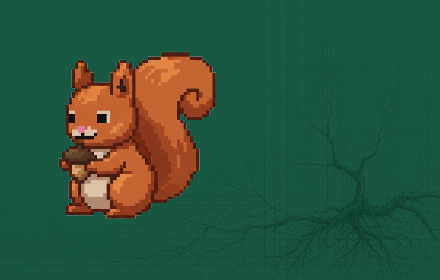
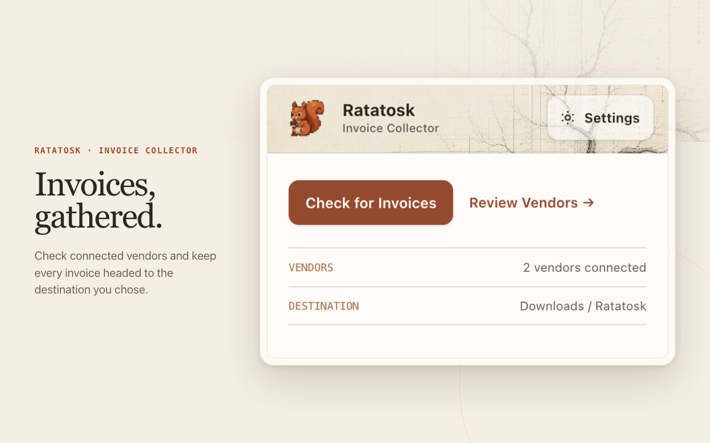
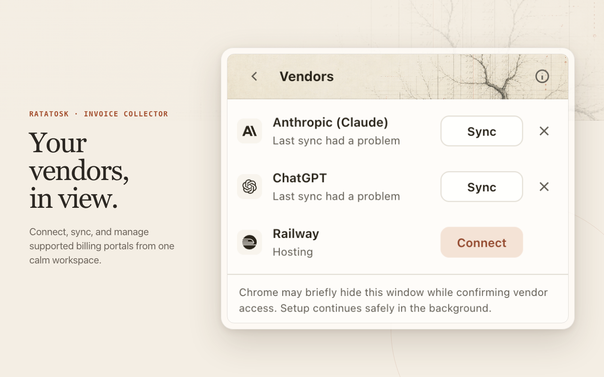

<p align="center">
  
</p>

<h1 align="center">Ratatosk</h1>

<p align="center"><strong>Your supplier invoices, collected from the billing portals you already use.</strong></p>

<p align="center">
  An open-source project by <a href="https://igdrasil.se/">Igdrasil AB</a>
  · <a href="LICENSE">MIT licensed</a>
  · <a href="PRIVACY.md">Privacy</a>
  · <a href="SECURITY.md">Security</a>
</p>

Ratatosk is an open-source Chrome extension project for collecting a user's own
supplier invoices and receipts from vendor billing portals. It uses the browser
session the user already has, so Ratatosk never asks for or stores vendor
passwords or two-factor codes.

The repository deliberately produces two separate extensions:

- **Collector** (`collector/`) is the consumer extension intended for Chrome Web
  Store review. It collects documents only after the user chooses a destination
  and connects a vendor. It does not include recording code or the `debugger`
  permission.
- **Studio** (`studio/`) is a development-only authoring extension. It records a
  billing page after explicit, informed consent and creates a redacted draft for
  a developer to review. It can also create an explicitly approved,
  structural-only [supplier fingerprint](docs/supplier-fingerprints.md) for Svala.
  Do not submit Studio as the consumer extension.

Shared, browser-independent code lives in `src/` and is used by both builds.

## Download Studio to add a new supplier

Studio is the developer build for collecting sanitized technical information
from a supplier's billing portal so a reviewed Ratatosk recipe can be created.
It is not the extension used for routine invoice collection.

Collector links here from its Vendors screen when a supplier is missing. You do
not need a Svala account or a special code to investigate an authorized supplier.

**[Download Ratatosk Studio v0.7.1 (ZIP)](https://github.com/Igdrasil-AB/ratatosk/releases/download/v0.7.1/ratatosk-studio-v0.7.1.zip)**
· [SHA-256 checksum](https://github.com/Igdrasil-AB/ratatosk/releases/download/v0.7.1/ratatosk-studio-v0.7.1.zip.sha256)

To install it in Chrome:

1. Download and unzip the Studio ZIP.
2. Open `chrome://extensions`.
3. Turn on **Developer mode**.
4. Select **Load unpacked** and choose the unzipped Studio folder containing
   `manifest.json`.

> **Developer build warning:** Studio requests Chrome's broad `debugger` and
> `activeTab` permissions so it can inspect a billing page after explicit
> consent. Install it only in a dedicated developer profile, use only authorized
> synthetic supplier accounts, and remove it when the supplier investigation is
> complete. Studio is separate from Collector and must not be submitted or
> distributed as the consumer extension.

See [adding a vendor](docs/adding-a-vendor.md) for the reviewed recipe and test
requirements.

Approved supplier fingerprints are always saved in Studio's bounded local
outbox and remain downloadable as JSON. An internal developer may also pair a
revocable, upload-only Svala intake token and explicitly deliver an item to the
single reviewed Svala endpoint; capture itself never sends automatically.

## Product preview

The Web Store presentation uses the same squirrel and rustic ledger-root artwork
as the extension itself.

<p align="center">
  
</p>

<p align="center">
  
</p>

## How Collector works

```text
chrome.alarms (user-controlled schedule)
   -> service worker wakes
   -> for each connected vendor
      -> verify the existing session
      -> call that vendor's billing endpoint
      -> map and de-duplicate invoices
      -> download the document
      -> save it to the destination the user selected
```

Vendor access is requested per vendor at connection time. With Igdrasil selected,
documents are uploaded to the user's Igdrasil company. With local downloads
selected, documents remain on the user's machine. Collector does not run a vendor
until a destination has been confirmed.

Recipes are declarative data, never executable code. The recipe schema is strict,
bounded, and interpreted only by logic packaged with the extension. Collector
does not download remote recipes or remotely hosted code. Official vendor
changes require a reviewed extension release. For an unsupported supplier, the
user can select **Find Invoices** from any page in the supplier app. Collector
first snapshots that page without navigating it, then reopens the exact approved
entry once in an inactive disposable tab before checking other same-origin,
billing-related pages. A temporary exact-origin `document_start`
observer is installed before that replay and captures bounded, sanitized JSON
fetch/XHR evidence while the SPA boots,
so the packaged inference can recognize GET APIs and explicit read-only GraphQL
POST queries without the Studio recorder or an AI fallback. The bounded planner combines URL intent with visible
navigation labels and nearby menu context, so an opaque route labelled `Invoices`
remains discoverable. If one high-confidence billing route renders only an empty
shell while inactive, Collector may give that disposable tab one bounded
visibility lease; it restores the previous tab afterward unless the user changed
tabs during the probe. Semantic verification uses the same lease through control
enumeration and document capture, so visibility-gated evidence remains
reproducible instead of disappearing after discovery. Opaque tenant values are reusable only when the exact
approved route placed them behind a trusted structural container such as
`/dashboard/org/{tenant}`. Observed Settings routes are retained as lower-confidence
bridges to billing pages, tenant-scoped `settings/billing` routes are prioritized,
and the best contextual/common route is scheduled after at most two observed-route
probes so one clue source cannot starve the others. Packaged adapters retain up
to three proof-ranked, strict local-only candidates spanning JSON APIs, embedded
data, invoice-context document links, explicit download controls, and icon-only
document actions proven by invoice-table, row, and action-column context. DOM-shaped
leads are verified only after Connect &
Collect, Ratatosk requests only their bounded exact-origin union, validates a
real PDF, and falls through candidate-local shape failures before saving the
integration. Connected local recipes can enumerate cursor, next-URL, numbered,
offset, localized Load More, and infinite-scroll invoice lists through packaged
bounded primitives—without storing remote code or cursor values.

When verification fails, the copied discovery diagnostic retains a closed,
privacy-safe root-cause trace: the failed collection stage, finite cause code,
optional HTTP status/content-type family, and structural retrieval proof
completed before the failure. It never includes URLs, selectors, response
content, tokens, or invoice identifiers.

## Repository layout

```text
collector/              public consumer extension
  manifest.config.ts    Collector-only MV3 permissions and entries
  src/platform/         Collector browser APIs, storage, scheduling, sinks
  src/ui/                Collector popup
  vite.config.ts         emits dist/collector

studio/                 development-only authoring extension
  manifest.config.ts    Studio-only MV3 permissions, including debugger
  src/platform/         consented capture and session storage
  src/ui/                Studio disclosure and recording UI
  vite.config.ts         emits dist/studio

src/
  core/                 platform-free engine and recipe schema
  ingest/               destination interfaces and implementations
  vendors/              reviewed recipes; public and experimental registries

test/                   core, platform, and vendor fixture tests
scripts/                validation, icon generation, deterministic packaging
store/                  Chrome Web Store copy and submission checklist
```

The dependency direction is `collector|studio -> shared src`; shared code never
imports Chrome extension APIs.

## Quick start

```bash
npm install
npm run ci
npm run build
```

Load Collector from `dist/collector` or Studio from `dist/studio` at
`chrome://extensions` using **Load unpacked**. Never load both from the same
directory.

Release the exact Collector artifact intended for review with:

```bash
npm run release:collector
```

This writes a ZIP and SHA-256 checksum under `artifacts/`. The ZIP contains the
Collector manifest at its root and excludes Studio.

Build and inspect the independent Studio release artifact with:

```bash
npm run release:studio
```

This runs the complete test and security gate, validates every vendor recipe and
fixture, and checks the Studio-specific authoring manifest before writing a
deterministic Studio-only ZIP and checksum. Collector release validation blocks
explicit health holds and malformed lifecycle metadata; live attestations remain
useful operational evidence but are not required for bundled pilot recipes. Publishing remains an explicit operator action;
the tag workflow runs only after a matching `v<package-version>` tag is pushed.

## Vendor status

Collector currently exposes Railway as a bundled pilot recipe. Other suppliers,
including Anthropic and ChatGPT, use the user-initiated generic discovery engine
so stale private API paths cannot override current browser evidence. GitHub,
Slack, and Vercel remain contributor examples and are not shipped by Collector.

See [testing a vendor](docs/testing.md), [adding a vendor](docs/adding-a-vendor.md),
[the architecture](docs/architecture.md), and the
[Chrome Web Store submission process](store/submission-process.md).

## Privacy and security

Collector includes no analytics or advertising SDK. Its actual data handling,
destinations, local retention, and permissions are documented in
[PRIVACY.md](PRIVACY.md), [SECURITY.md](SECURITY.md), and the
[store listing draft](store/listing.md).

## License

MIT — see [LICENSE](LICENSE).
